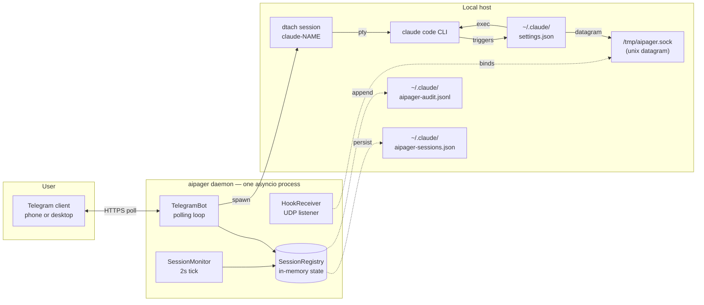

# Architecture

aipager is a single-process asyncio daemon. It bridges three worlds:
your Telegram chat, the Claude Code CLI processes you run under
`dtach`, and the Claude Code hooks system. Everything funnels through
one event loop — there are no worker pools, no databases, no
inter-process queues.

## Component diagram

The arrows are all in-process or local — no third-party servers
participate beyond Telegram's API. See [security](security.md) for
the network surface.

## Process model

One `asyncio.run` invocation in `aipager/cli.py:206` runs the whole
show. Inside that:

- **`TelegramBot`** (`aipager/telegram_bot.py`) — owns a
  `python-telegram-bot` `Application`. Polls for updates, dispatches
  to message / callback / voice handlers, emits message edits for
  busy-state animations.
- **`HookReceiver`** (`aipager/hook_receiver.py`) — opens a unix
  datagram socket at `/tmp/aipager.sock`, decodes JSON payloads from
  the `aipager-hook` helper, dispatches by `"event"` field.
- **`SessionMonitor`** (`aipager/session_monitor.py`) — wakes every
  2 s to scan `/tmp/claude-dtach-*.sock`, reconcile against the
  registry, and time out stuck `INTERACTIVE` sessions
  (`AIPAGER_INTERACTIVE_TIMEOUT`).
- **`SessionRegistry`** (`aipager/state.py`) — in-memory dict of
  `TrackedSession` objects keyed by name. Serializes to
  `~/.claude/aipager-sessions.json` on shutdown and on every state
  transition that matters.
- **`ObserverBroadcaster`** (optional, `aipager/observer.py`) — if
  `AIPAGER_OBSERVERS` is set, also forwards messages to read-only
  observer bots.

All four run as async tasks on the same loop. No threads (except the
faster-whisper executor for voice transcription, which is fire-and-
forget per call).

## Boot sequence

From `aipager/cli.py:159-184`:

1. `SessionRegistry.load()` — reads `~/.claude/aipager-sessions.json`,
   rehydrates `TrackedSession` objects, drops stale queue entries
   (>24 h).
2. `TelegramBot.__init__` + `bot.start()` — verifies token / chat,
   starts the polling loop.
3. `ObserverBroadcaster.start()` — only when configured.
4. `HookReceiver.start()` — unlinks any stale `/tmp/aipager.sock`,
   binds fresh, listens.
5. `bot.recover_sessions()` — for every `BUSY` session whose
   `busy_msg_id` exists, edit the Telegram message to reflect the
   live state. Skips `vanished`, `too_old`, `flooded` cases
   gracefully.
6. `SessionMonitor.start()` — begins the 2 s tick.
7. Daemon enters its `asyncio.Event` wait, ready for signals.

## Shutdown sequence

From `aipager/cli.py:186-193`:

1. SIGINT or SIGTERM sets the `stop` event.
2. `registry.save()` — persist state.
3. `session_monitor.stop()` — cancel the tick task.
4. `hook_receiver.stop()` — close the datagram transport and
   `os.unlink(/tmp/aipager.sock)`.
5. `observers.stop()` if running.
6. `bot.stop()` — cancel per-session animation tasks, stop the
   `Application` (which flushes pending edits).
7. Process exits cleanly.

The Telegram-driven self-restart in
`telegram_bot.py:_restart_daemon` relies on this entire path running
to completion before the spawned replacement binds the socket. See
[bot commands → restart](commands.md#restart) for the user-facing
behaviour.

## File and socket layout

| Path | Purpose | Owner |
|---|---|---|
| `/tmp/aipager.sock` | Unix datagram for hook events | aipager daemon (binds) |
| `/tmp/claude-dtach-<name>.sock` | dtach control socket per session | dtach |
| `/tmp/claude-status-<name>.json` | Statusline data per session | `aipager-statusline` hook |
| `~/.claude/aipager-sessions.json` | Durable registry state | aipager daemon |
| `~/.claude/aipager-audit.jsonl` | Allow / Deny / answer log | aipager daemon (append-only) |
| `~/.claude/settings.json` | Claude Code hook config | written by `aipager config` |
| `~/.claude/settings.json.bak.*` | Backups before each rewrite | `aipager config` |
| `~/.config/aipager/config.env` | Bot token, chat ID, observer bots | `aipager config` (mode 600) |
| `~/.config/aipager/keyboard.json` | Optional keyboard overrides | user |

The daemon writes nothing outside `~/.config/aipager`, `~/.claude/`,
and `/tmp/aipager.sock`. It never elevates — see
[security](security.md#privilege-boundary).

## Why dtach

dtach gives each Claude Code session a real PTY without binding it
to a terminal that has to stay open. The aipager daemon attaches
non-interactively via `dtach -a -E` to read the output stream and
inject keystrokes; the user can also attach interactively from any
shell via `aipager session <name>` for direct access.

The result: Claude Code runs as if you typed in a terminal, but
that terminal can come and go without disturbing the running session.
The daemon discovers sessions by scanning `/tmp/claude-dtach-*.sock`
on each 2 s monitor tick.

## See also

- [Hook events](hooks.md) — what flows in over `/tmp/aipager.sock`.
- [Bot commands](commands.md) — what flows in from Telegram.
- [Security model](security.md) — privilege boundary, secrets, audit.
- [Troubleshooting](troubleshooting.md) — `aipager doctor` reference.
