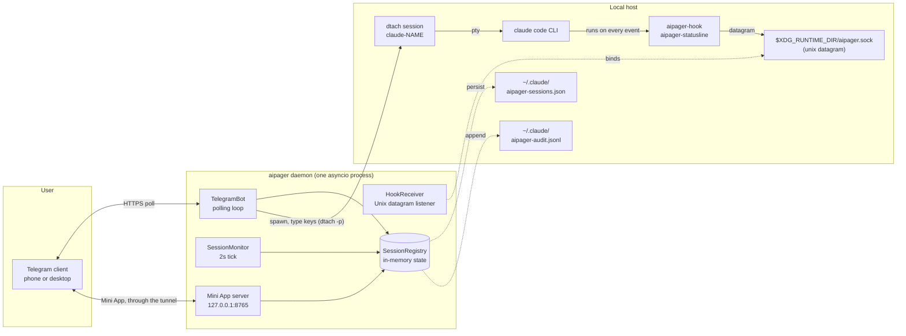

# Architecture

aipager is a single-process asyncio daemon. It bridges three worlds:
your Telegram chat, the Claude Code CLI processes you run under
`dtach`, and the Claude Code hooks system. Everything funnels through
one event loop: no worker pools, no databases, no inter-process queues.

## Component diagram

```mermaid
flowchart LR
  subgraph User
    TG["Telegram client<br>phone or desktop"]
  end

  subgraph Daemon["aipager daemon (one asyncio process)"]
    direction TB
    Bot["TelegramBot<br>polling loop"]
    HookRx["HookReceiver<br>Unix datagram listener"]
    Mon["SessionMonitor<br>2s tick"]
    App["Mini App server<br>127.0.0.1:8765"]
    Reg[("SessionRegistry<br>in-memory state")]
  end

  subgraph Host["Local host"]
    direction TB
    Sock["$XDG_RUNTIME_DIR/aipager.sock<br>(unix datagram)"]
    Dtach["dtach session<br>claude-NAME"]
    Claude["claude code CLI"]
    Hooks["aipager-hook<br>aipager-statusline"]
    State["~/.claude/<br>aipager-sessions.json"]
    Audit["~/.claude/<br>aipager-audit.jsonl"]
  end

  TG <-->|HTTPS poll| Bot
  TG <-->|Mini App, through the tunnel| App
  Bot --> Reg
  Mon --> Reg
  App --> Reg
  Reg -. persist .-> State
  Reg -. append .-> Audit

  HookRx -. binds .-> Sock
  Hooks -- datagram --> Sock
  Bot -- "spawn, type keys (dtach -p)" --> Dtach
  Dtach -- pty --> Claude
  Claude -- runs on every event --> Hooks
```

Everything in the diagram runs on this machine except Telegram. The
daemon also talks to a few other hosts: the Mini App's Cloudflare
tunnel (and GitHub, once, for its `cloudflared`), `telegram.org` for
the Mini App's script, version checks when you ask for an update, the
speech model's download when you first use voice, and the problem
report endpoint when you send one. They are all listed under
[security → network surface](security.md#network-surface).

## Process model

One `asyncio.run` invocation in `aipager/cli/daemon.py` runs the
whole show. Inside that:

- **`TelegramBot`** (`aipager/bot/`): owns a `python-telegram-bot`
  `Application`. Polls for updates, dispatches to message / callback /
  voice handlers, and keeps the busy cards, the pinned status bar and
  the answers up to date.
- **`HookReceiver`** (`aipager/dtach/hook_receiver.py`): binds a Unix
  datagram socket at `$XDG_RUNTIME_DIR/aipager.sock` and decodes the
  JSON the `aipager-hook` and `aipager-statusline` helpers send,
  dispatching on its `hook_event_name` (or `type`, for aipager's own
  messages; see [hooks](hooks.md)).
- **`SessionMonitor`** (`aipager/session_monitor.py`): wakes every 2 s
  to scan `/tmp/claude-dtach-*.sock`, reconcile the sessions it finds
  with the registry, and run the watchdogs: a busy card that stopped
  moving, a prompt Claude Code never took, a permission prompt with no
  news for 5 minutes (`AIPAGER_INTERACTIVE_TIMEOUT`), a turn whose end
  was missed.
- **`SessionRegistry`** (`aipager/state.py`): the `TrackedSession`
  objects keyed by name. Saved to `~/.claude/aipager-sessions.json`
  (atomically) on shutdown and whenever something that must survive a
  restart changes.
- **`ObserverBroadcaster`** (optional, `aipager/bot/observer.py`): if
  `OBSERVER_BOTS` is set, also sends notices to read-only observer
  bots ([observers](observers.md)).
- **Mini App server** (`aipager/miniapp/server.py`): an aiohttp app
  bound to `127.0.0.1` on `MINIAPP_PORT` (default 8765), published to
  Telegram through a managed Cloudflare tunnel while enabled (the
  default). Serves the `/app` dashboard.

All of these run as tasks on the same loop. Work that would block it
runs in worker threads: voice transcription, building and sending a
problem report, update checks and restart planning, the downloads of
the Mini App script and `cloudflared`, and the start-up login check.

## Boot sequence

From `aipager/cli/daemon.py`:

1. Move an old configuration (`config.env`, `team.yaml`) to
   `aipager.yaml`, once, and retire the old files.
2. Refuse to start if another daemon answers on the socket, then take
   the daemon lock (`~/.local/share/aipager/daemon.lock`).
3. Check the bot token with Telegram (`getMe`).
4. Fix up Claude Code's own files: add any missing aipager hook and the
   status line to `~/.claude/settings.json`, and answer the
   first-launch questions a Telegram user could not answer (see
   [security](security.md#who-decides-whether-a-tool-call-runs)).
5. `SessionRegistry.load()`: reads `~/.claude/aipager-sessions.json`.
   A missing or unreadable file starts empty.
6. Resolve the Mini App's address (your own URL, or Tailscale), then
   `bot.start()`: starts polling.
7. `ObserverBroadcaster.start()`, only when configured.
8. `HookReceiver.start()`: removes a stale socket file, binds, listens.
9. `bot.recover_sessions()`: brings back the cards and prompts of
   sessions that were working or waiting when the daemon stopped (see
   [commands → idle responses](commands.md#idle-responses)).
10. `SessionMonitor.start()`: begins the 2 s tick.
11. The Mini App server starts, then the tunnel (when no URL of your own
    is set), and the `📱 App` buttons are published.
12. The daemon waits for signals: SIGINT or SIGTERM stops it, SIGUSR1
    reloads the chats and rules ([groups → live reload](groups.md#live-reload)).

## Shutdown sequence

1. SIGINT or SIGTERM sets the `stop` event.
2. A running `/update` gets a short grace, then its installer is
   stopped (see [commands → update](commands.md#update)).
3. `registry.save()`.
4. The tunnel stops, then the Mini App server.
5. `session_monitor.stop()`, `hook_receiver.stop()` (closes the socket
   and removes its file), `observers.stop()` if running.
6. `bot.stop()`: cancels the animations and stops the `Application`.
7. `registry.save()` again, for a card whose send was still in flight.

The Telegram-driven self-restart relies on this whole path running
to completion before the replacement binds the socket. See
[bot commands → restart](commands.md#restart) for the user-facing
behaviour.

## File and socket layout

| Path | Purpose | Owner |
|---|---|---|
| `$XDG_RUNTIME_DIR/aipager.sock` | Unix datagram socket for hook events (`/tmp/aipager.sock` without `$XDG_RUNTIME_DIR`; `$AIPAGER_SOCKET_PATH` overrides both) | aipager daemon (binds) |
| `aipager-reply-<id>.sock` (beside the control socket) | One short-lived reply socket per permission prompt the hook waits on | `aipager-hook` |
| `aipager-flood-mute.json`, `aipager-flood-backoff.json` (beside the control socket) | The current Telegram rate-limit state, for `aipager status` and the doctor | aipager daemon |
| `aipager-modelswitch-<name>.json` (beside the control socket) | Marks a model switch aipager typed, for 30 s ([hooks](hooks.md#premodelswitch)) | aipager daemon (written), `aipager-hook` (claimed) |
| `/tmp/claude-dtach-<name>.sock` | dtach control socket per session | dtach |
| `/tmp/claude-status-<name>.json` | Statusline data per session | `aipager-statusline` |
| `/tmp/claude-notes-<name>/` | One permission note per not-yet-picked-up Telegram message, and a `turn-open` mark the hook keeps while a turn runs (a message that joins the turn can only narrow its rules) | aipager daemon (notes, written), `aipager-hook` (notes consumed; `turn-open` written, and cleared by both) |
| `/tmp/claude-policy-<name>.json` | Canonical permission snapshot for the running turn | `aipager-hook` (written at pick-up), read by the `PreToolUse` check |
| `/tmp/claude-policy-.floor-<uid>.json` | The safety floor, built-in list plus your `safety:` section, for the hook's fallbacks | aipager daemon |
| `/tmp/claude-reply-<name>.txt` | The message you replied to, when you reply to an older message | aipager daemon |
| `/tmp/aipager-files/` | Files and voice notes sent from Telegram | aipager daemon |
| `/tmp/aipager.log` | Output of a self-restart when there is no service | aipager daemon |
| `~/.claude/aipager-sessions.json` | Durable registry state | aipager daemon |
| `~/.claude/aipager-audit.jsonl` | Allow / Deny / answer log | aipager daemon (append-only) |
| `~/.claude/aipager-flood-state.json` | Each chat's Telegram rate-limit history, kept across restarts ([troubleshooting](troubleshooting.md#the-bot-went-quiet-flood-control)) | aipager daemon |
| `~/.claude/aipager-pending-users.json` | People who addressed the bot in a group it does not serve, or who are not members of a group it serves, for `aipager config` to add (mode 0600, replaced whole on each write, the newest 200 seen in the last 30 days) | aipager daemon (written), `aipager config` (read) |
| `~/.claude/settings.json` | Claude Code hook config | `aipager config` / `aipager setup`; at every start the daemon adds any missing aipager hook or status line and sets `skipDangerousModePermissionPrompt` ([security](security.md#who-decides-whether-a-tool-call-runs)) |
| `~/.claude/settings.json.bak.*` | Backups before each rewrite | `aipager config`, `aipager setup`, `aipager uninstall` |
| `~/.claude.json` | Claude Code's own file: at start aipager marks its default session folder (the daemon's working directory, or `AIPAGER_WORK_DIR`) as trusted, so Claude Code's trust question does not block a session started from Telegram in that folder | aipager daemon |
| `~/.claude/.credentials.json` → `.credentials.json.stale` | Claude Code's login file, moved aside when a session starts with `CLAUDE_CODE_OAUTH_TOKEN` set and the file holds only an expired or empty login (it would otherwise win over the token); move it back to undo | aipager daemon |
| `~/.config/aipager/aipager.yaml` | Bot token, chats, members + roles, Mini App settings | `aipager config` (mode 600); the daemon moves a group's entry when Telegram upgrades it to a supergroup, and keeps an `aipager.yaml.bak.<time>` copy when it moves old Mini App settings into it |
| `~/.config/aipager/policy.yaml` | Per-role rules + safety overrides | user (checked via `aipager policy validate`); a commented starter is written once when an old install is migrated |
| `~/.config/aipager/preferences.json` | The `/settings` choices of each chat and session | aipager daemon |
| `~/.config/aipager/daemon.env` | Claude credential for launched sessions | user / `aipager service install` / `aipager doctor --fix` (mode 600) |
| `~/.config/aipager/config.env`, `team.yaml` → `*.bak.<time>`, `*.retired.<time>` | An old install's configuration: copied, then renamed aside once `aipager.yaml` holds it | aipager daemon, `aipager config`, `aipager setup` |
| `~/.config/aipager/keyboard.json` | Optional keyboard overrides | user |
| `~/.local/share/aipager/sessions/` | One folder per session with its `SESSION.md` (who may address it, and the rules), rebuilt at every launch | aipager daemon |
| `~/.local/share/aipager/webapp-sdk/`, `cloudflared/` | Telegram's Mini App script and the verified `cloudflared` binary | aipager daemon |
| `~/.local/share/aipager/daemon.lock`, `update.lock`, `update-restart.json` | One daemon at a time; one update at a time; the update to announce after the restart | aipager daemon |
| `~/.local/share/aipager/install.json`, `running.json` | When aipager first started here; whether it is running now (to tell a crash from a clean stop) | aipager daemon |
| `~/.local/state/aipager/reports.json` | Problem reports: recorded error fingerprints, counts and the offer state (mode 600); see [problem reports](problem-reports.md#what-is-kept-on-your-machine) | aipager daemon |
| `~/.local/state/aipager/report-sends.json` | Problem reports sent today (the daily limit) | aipager daemon, `aipager report` |
| `~/.config/systemd/user/aipager.service` (Linux), `~/Library/LaunchAgents/com.aipager.daemon.plist` (macOS), and a `.bak.<time>` copy of the one an install replaces (on Linux only when it differs) | The background service | `aipager service install` |
| `~/Library/Logs/aipager.log` (macOS) | The launchd service's log, read by `aipager logs` | launchd, for the service |

Besides these, aipager creates a new session folder when you ask for
one (New folder in `/new` or the Mini App), and the installers and the
voice model write their own files when you update or use voice. All of
it is under your home folder, under `/tmp`, or beside the control
socket. aipager never elevates; see
[security](security.md#privilege-boundary).

### Isolated instance (for testing)

Set `AIPAGER_INSTANCE_DIR` to an absolute folder you own and every
shared runtime file above moves into it: the control socket (and the
reply sockets, flood signal files and model-switch marker beside it),
the `claude-dtach-*` sockets, the `claude-policy-*`, `claude-notes-*`,
`claude-status-*` and `claude-reply-*` files, the policy floor file,
the `aipager-files` download folder and the self-restart log. Sessions
the instance starts inherit the setting, so their hooks talk only to
that instance, and the safety rules protect the moved files the same
way. The instance does not read a checkout's `.env`.

The files under your home folder do not move, so point `HOME` at a
separate folder too. `aipager start` refuses to run when the instance
folder is set and `HOME` is your real home folder, when the folder is
not an absolute path to a folder you own, or when it is too long for a
socket path.

`/update` and `/restart` are not isolated: they act on the installed
aipager package and the `aipager.service` unit, so never send them to a
test instance.

`AIPAGER_TELEGRAM_API_BASE` (for example `http://127.0.0.1:41234`)
sends every Bot API request and file download to that address instead
of `https://api.telegram.org`. It must be this machine (`localhost` or
a loopback address) unless `AIPAGER_TELEGRAM_API_ALLOW_REMOTE=1`, so a
typo cannot send the bot token anywhere else.

Both settings exist so the end-to-end tests can run a second daemon
against a local stand-in for Telegram beside your real one. With
neither set, every path and address is the one in the table above.

## Why dtach

dtach gives each Claude Code session a real PTY without binding it
to a terminal that has to stay open. The daemon starts a session with
`dtach -n` and types into it with `dtach -p` (prompts, Escape, the keys
that answer a dialog); it never reads the screen, since the hooks and
the transcript say what happens. You can attach interactively from any
shell via `aipager session <name>` for direct access. That attach
follows the session through a restart from Telegram (`/mode`,
`/restart`, Restart): when the session's socket goes away it waits up
to 15 s for the same socket to come back and reattaches on its own.
A session that really ended returns to the shell after the wait
(Ctrl-C ends it sooner). The attach runs with dtach's detach key
turned off, so `Ctrl-\` goes to Claude; to leave, close the terminal
or tmux pane and the session keeps running.

The result: Claude Code runs as if you typed in a terminal, but
that terminal can come and go without disturbing the running session.
The daemon discovers sessions by scanning `/tmp/claude-dtach-*.sock`
on each 2 s monitor tick. A discovered session belongs to the chat its
name was made for, and one started in the terminal belongs to the
owner's DM on an install with a DM and a group.

## See also

- [Hook events](hooks.md) - what flows in over the control socket.
- [Bot commands](commands.md) - what flows in from Telegram.
- [Security model](security.md) - privilege boundary, secrets, audit.
- [Troubleshooting](troubleshooting.md) - `aipager doctor` reference.
