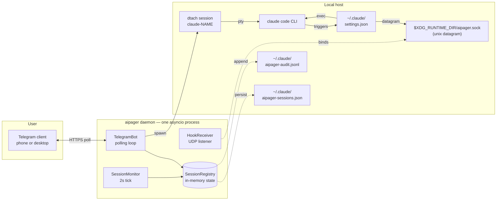

# Architecture

aipager is a single-process asyncio daemon. It bridges three worlds:
your Telegram chat, the Claude Code CLI processes you run under
`dtach`, and the Claude Code hooks system. Everything funnels through
one event loop — there are no worker pools, no databases, no
inter-process queues.

## Component diagram

```mermaid
flowchart LR
  subgraph User
    TG["Telegram client<br>phone or desktop"]
  end

  subgraph Daemon["aipager daemon — one asyncio process"]
    direction TB
    Bot["TelegramBot<br>polling loop"]
    HookRx["HookReceiver<br>UDP listener"]
    Mon["SessionMonitor<br>2s tick"]
    Reg[("SessionRegistry<br>in-memory state")]
  end

  subgraph Host["Local host"]
    direction TB
    Sock["$XDG_RUNTIME_DIR/aipager.sock<br>(unix datagram)"]
    Dtach["dtach session<br>claude-NAME"]
    Claude["claude code CLI"]
    Hooks["~/.claude/<br>settings.json"]
    State["~/.claude/<br>aipager-sessions.json"]
    Audit["~/.claude/<br>aipager-audit.jsonl"]
  end

  TG <-->|HTTPS poll| Bot
  Bot --> Reg
  Mon --> Reg
  Reg -. persist .-> State
  Reg -. append .-> Audit

  HookRx -. binds .-> Sock
  Hooks -- datagram --> Sock
  Hooks -- exec --> Claude
  Bot -- spawn --> Dtach
  Dtach -- pty --> Claude
  Claude -- triggers --> Hooks
```

The arrows are all in-process or local — no third-party servers
participate beyond Telegram's API. See [security](security.md) for
the network surface.

## Process model

One `asyncio.run` invocation in `aipager/cli/daemon.py` runs the
whole show. Inside that:

- **`TelegramBot`** (`aipager/bot/`) — owns a
  `python-telegram-bot` `Application`. Polls for updates, dispatches
  to message / callback / voice handlers, emits message edits for
  busy-state animations.
- **`HookReceiver`** (`aipager/dtach/hook_receiver.py`) — opens a unix
  datagram socket at `$XDG_RUNTIME_DIR/aipager.sock`, decodes JSON payloads from
  the `aipager-hook` helper, dispatches by `"event"` field.
- **`SessionMonitor`** (`aipager/session_monitor.py`) — wakes every
  2 s to scan `/tmp/claude-dtach-*.sock`, reconcile against the
  registry, and time out stuck `INTERACTIVE` sessions
  (`AIPAGER_INTERACTIVE_TIMEOUT`).
- **`SessionRegistry`** (`aipager/state.py`) — in-memory dict of
  `TrackedSession` objects keyed by name. Serializes to
  `~/.claude/aipager-sessions.json` on shutdown and on every state
  transition that matters.
- **`ObserverBroadcaster`** (optional, `aipager/bot/observer.py`) — if
  `OBSERVER_BOTS` is set, also forwards messages to read-only
  observer bots.
- **Mini App server** (`aipager/miniapp/server.py`) — an aiohttp app
  bound to `127.0.0.1:8765`, published to Telegram through a managed
  tunnel while enabled (the default). Serves the `/app` dashboard.

All of these run as async tasks on the same loop. No threads (except the
faster-whisper executor for voice transcription, which is fire-and-
forget per call).

## Boot sequence

From `aipager/cli/daemon.py`:

1. `SessionRegistry.load()` — reads `~/.claude/aipager-sessions.json`,
   rehydrates `TrackedSession` objects, drops stale queue entries
   (>24 h).
2. `TelegramBot.__init__` + `bot.start()` — verifies token / chat,
   starts the polling loop.
3. `ObserverBroadcaster.start()` — only when configured.
4. `HookReceiver.start()` — unlinks any stale `$XDG_RUNTIME_DIR/aipager.sock`,
   binds fresh, listens.
5. `bot.recover_sessions()` — for every `BUSY` session whose
   `busy_msg_id` exists, edit the Telegram message to reflect the
   live state. Skips `vanished`, `too_old`, `flooded` cases
   gracefully.
6. `SessionMonitor.start()` — begins the 2 s tick.
7. Daemon enters its `asyncio.Event` wait, ready for signals.

## Shutdown sequence

From `aipager/cli/daemon.py`:

1. SIGINT or SIGTERM sets the `stop` event.
2. `registry.save()` — persist state.
3. `session_monitor.stop()` — cancel the tick task.
4. `hook_receiver.stop()` — close the datagram transport and
   `os.unlink(config.SOCKET_PATH)`.
5. `observers.stop()` if running.
6. `bot.stop()` — cancel per-session animation tasks, stop the
   `Application` (which flushes pending edits).
7. Process exits cleanly.

The Telegram-driven self-restart relies on this entire path running
to completion before the spawned replacement binds the socket. See
[bot commands → restart](commands.md#restart) for the user-facing
behaviour.

## File and socket layout

| Path | Purpose | Owner |
|---|---|---|
| `$XDG_RUNTIME_DIR/aipager.sock` | Unix datagram for hook events (falls back to `/tmp/aipager.sock`) | aipager daemon (binds) |
| `/tmp/claude-dtach-<name>.sock` | dtach control socket per session | dtach |
| `/tmp/claude-status-<name>.json` | Statusline data per session | `aipager-statusline` hook |
| `/tmp/claude-notes-<name>/` | One permission note per not-yet-picked-up Telegram message, and a `turn-open` mark the hook keeps while a turn runs (a message that joins the turn can only narrow its rules) | aipager daemon (notes, written), `aipager-hook` (notes consumed; `turn-open` written, and cleared by both) |
| `/tmp/claude-policy-<name>.json` | Canonical permission snapshot for the running turn | `aipager-hook` (written at pick-up), read by the `PreToolUse` check |
| `~/.claude/aipager-sessions.json` | Durable registry state | aipager daemon |
| `~/.claude/aipager-audit.jsonl` | Allow / Deny / answer log | aipager daemon (append-only) |
| `~/.claude/aipager-pending-users.json` | People who addressed the bot in a group it does not serve, or who are not members of a group it serves, for `aipager config` to add (mode 0600, replaced whole on each write, the newest 200 seen in the last 30 days) | aipager daemon (written), `aipager config` (read) |
| `~/.claude/settings.json` | Claude Code hook config | written by `aipager config` |
| `~/.claude/settings.json.bak.*` | Backups before each rewrite | `aipager config` |
| `~/.config/aipager/aipager.yaml` | Bot token, chats, members + roles, Mini App settings | `aipager config` (mode 600); the daemon moves a group's entry when Telegram upgrades it to a supergroup |
| `~/.config/aipager/policy.yaml` | Per-role rules + safety overrides | user (checked via `aipager policy validate`) |
| `~/.config/aipager/daemon.env` | Claude credential for launched sessions | user / `aipager doctor --fix` (mode 600) |
| `~/.config/aipager/keyboard.json` | Optional keyboard overrides | user |

The daemon writes nothing outside `~/.config/aipager`, `~/.claude/`,
and its control socket. It never elevates — see
[security](security.md#privilege-boundary).

### Isolated instance (for testing)

Set `AIPAGER_INSTANCE_DIR` to an absolute folder you own and every
shared runtime file above moves into it: the control socket (and the
reply sockets, flood signal files and model-switch marker beside it),
the `claude-dtach-*` sockets, the `claude-policy-*`, `claude-notes-*`,
`claude-status-*` and `claude-reply-*` files, the policy floor file,
the `aipager-files` download folder and the self-restart log. Sessions
the instance starts inherit the setting, so their hooks talk only to
that instance, and the safety rules protect the moved files the same
way. The instance does not read a checkout's `.env`.

The files under your home folder do not move, so point `HOME` at a
separate folder too. `aipager start` refuses to run when the instance
folder is set and `HOME` is your real home folder, when the folder is
not an absolute path to a folder you own, or when it is too long for a
socket path.

`/update` and `/restart` are not isolated: they act on the installed
aipager package and the `aipager.service` unit, so never send them to a
test instance.

`AIPAGER_TELEGRAM_API_BASE` (for example `http://127.0.0.1:41234`)
sends every Bot API request and file download to that address instead
of `https://api.telegram.org`. It must be this machine (`localhost` or
a loopback address) unless `AIPAGER_TELEGRAM_API_ALLOW_REMOTE=1`, so a
typo cannot send the bot token anywhere else.

Both settings exist so the end-to-end tests can run a second daemon
against a local stand-in for Telegram beside your real one. With
neither set, every path and address is the one in the table above.

## Why dtach

dtach gives each Claude Code session a real PTY without binding it
to a terminal that has to stay open. The aipager daemon attaches
non-interactively via `dtach -a -E` to read the output stream and
inject keystrokes; the user can also attach interactively from any
shell via `aipager session <name>` for direct access. That attach
follows the session through a restart from Telegram (`/mode`,
`/restart`, Restart): when the session's socket goes away it waits up
to 15 s for the same socket to come back and reattaches on its own.
A session that really ended returns to the shell after the wait
(Ctrl-C ends it sooner). The attach runs with dtach's detach key
turned off, so `Ctrl-\` goes to Claude; to leave, close the terminal
or tmux pane and the session keeps running.

The result: Claude Code runs as if you typed in a terminal, but
that terminal can come and go without disturbing the running session.
The daemon discovers sessions by scanning `/tmp/claude-dtach-*.sock`
on each 2 s monitor tick. A discovered session belongs to the chat its
name was made for, and one started in the terminal belongs to the
owner's DM on an install with a DM and a group.

## See also

- [Hook events](hooks.md) — what flows in over the control socket.
- [Bot commands](commands.md) — what flows in from Telegram.
- [Security model](security.md) — privilege boundary, secrets, audit.
- [Troubleshooting](troubleshooting.md) — `aipager doctor` reference.
